## kottans-frontend

kottans-frontend course
## How to use Git and GitHub

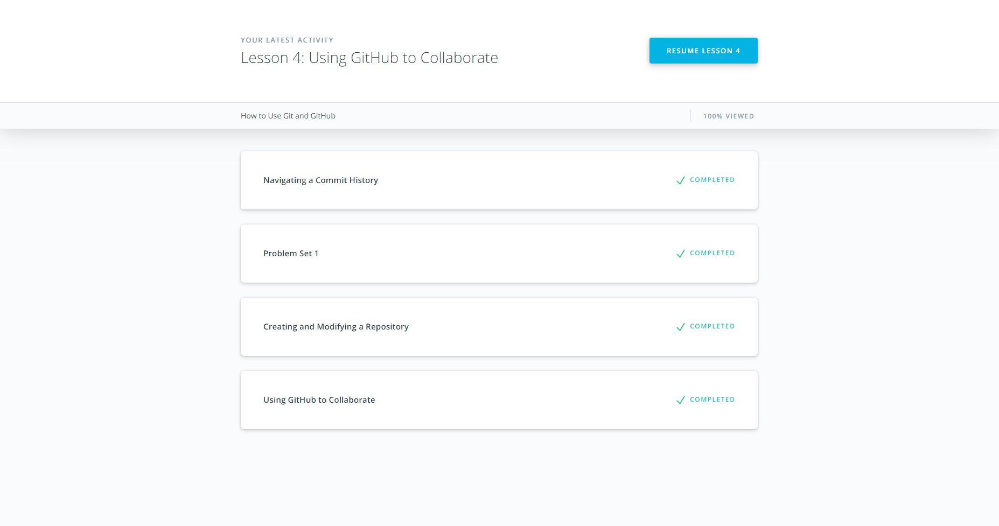
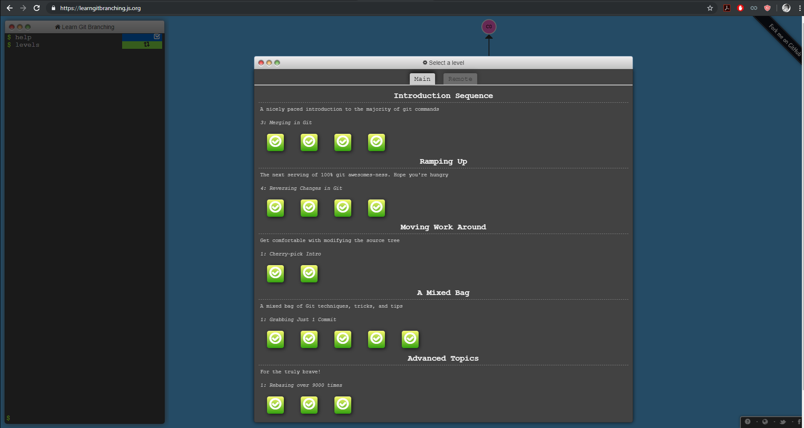
It was really useful course for me, I knew about git in general but I always afraid to delete something actually now I'm still careful with commits but know how to fix it.

## Linux CLI, and HTTP

Learned how to use the bash profile to configure the environment. Articles about HTTP was extremely useful for me.

## Git Collaboration 
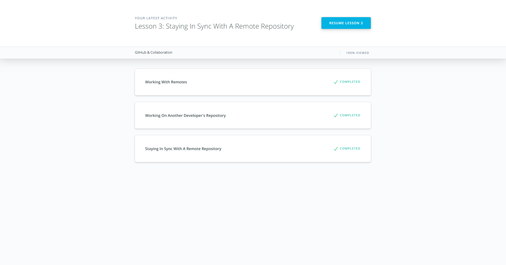
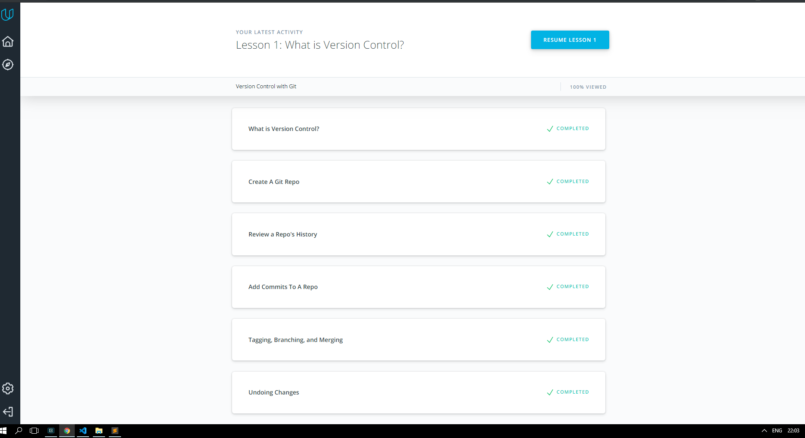
Special thanks for this material - understandable, nice way of explaing, also it was useful to refresh my knowledge.

## Intro to HTML and CSS
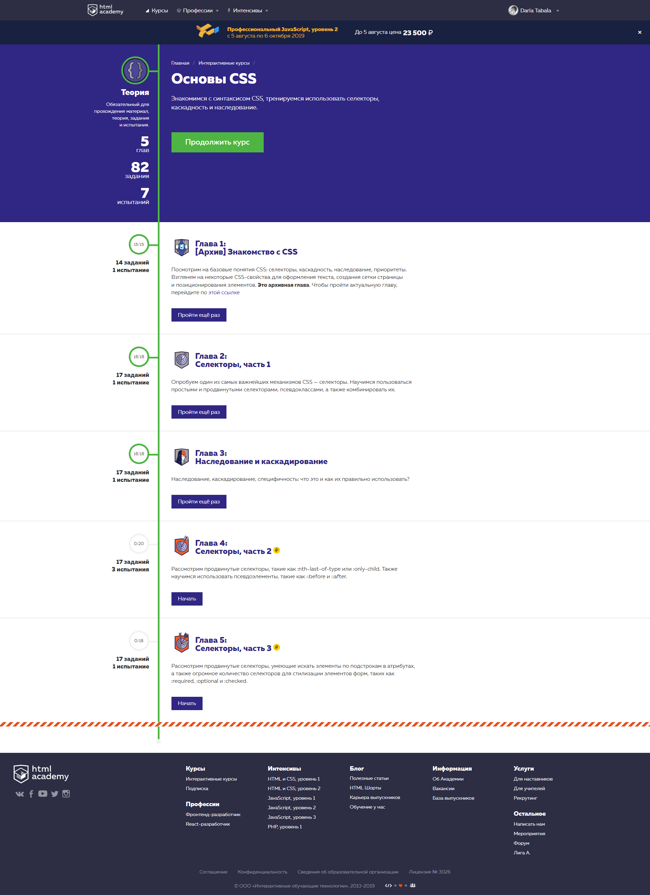
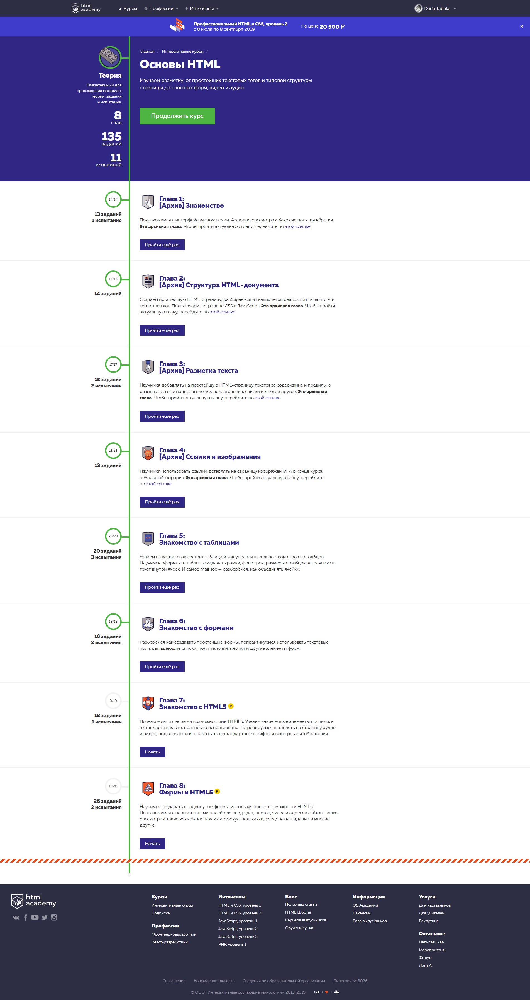
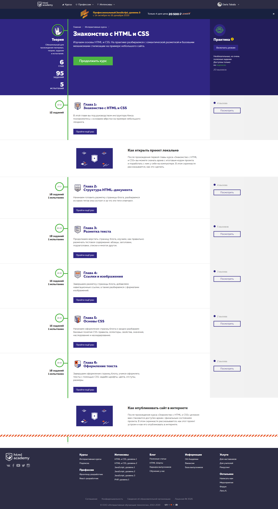
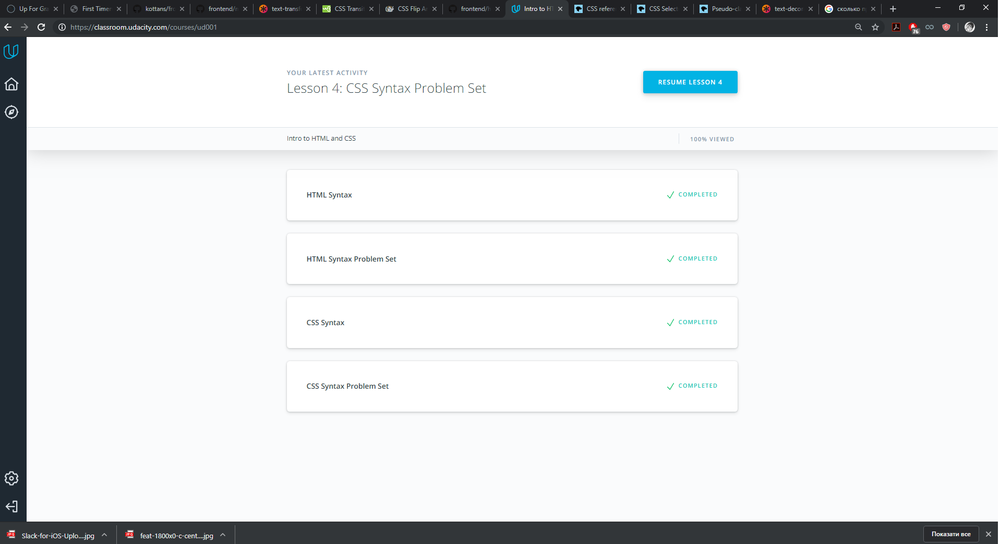
Nice, simple course for beginners, as for me too much similar tasks.

## Responsive Web Design
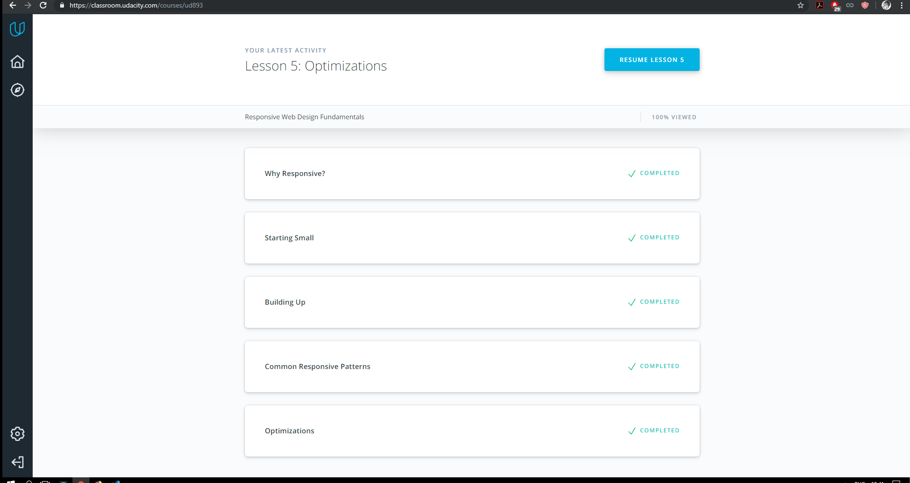
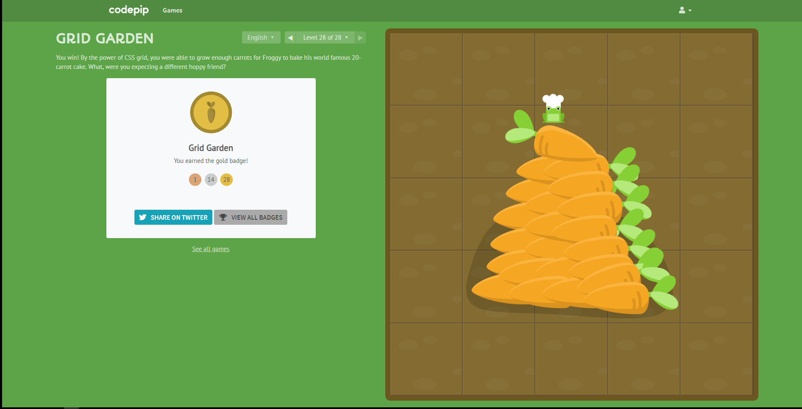
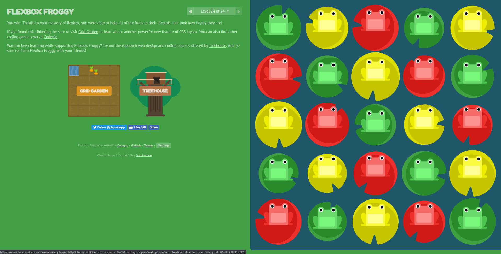
Great course, now I see my future web design from another side, one important benefit of a responsive layout is the guarantee that any user on any device will have the best experience possible on your website.

## HTML & CSS practice:Popup
[Demo](https://dashakim.github.io) |
[Code base](https://github.com/dashakim/kottans-frontend/tree/master/task_html_css_popup)
I was my first practice challenge. Now I know how important to write in my own way and fix the errors. Review helps to understand where I can improve my task.
